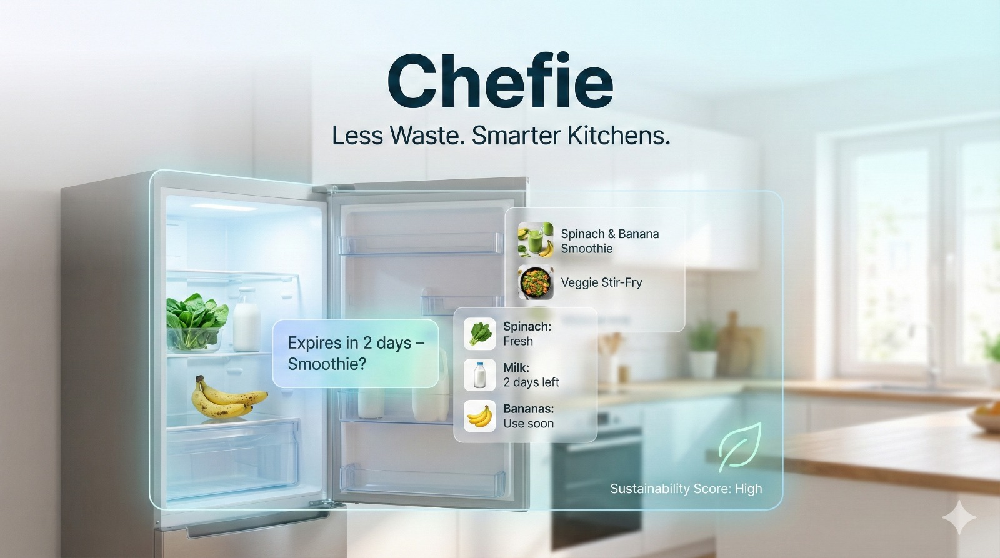
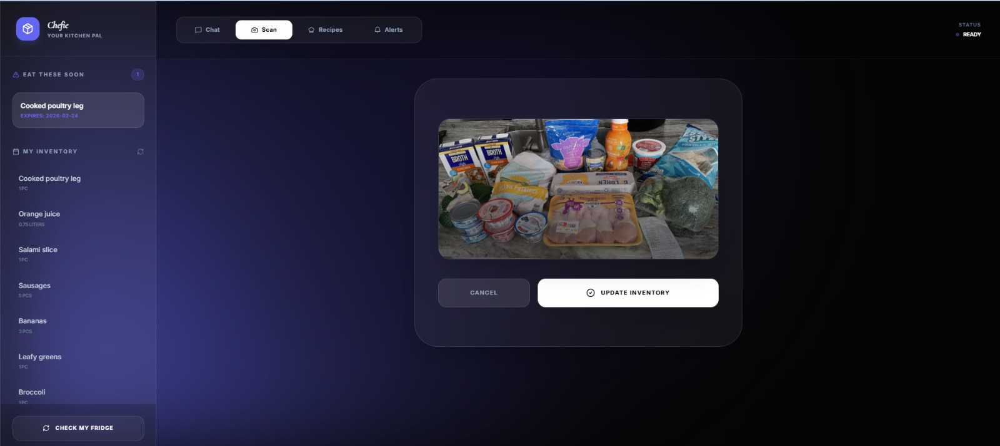
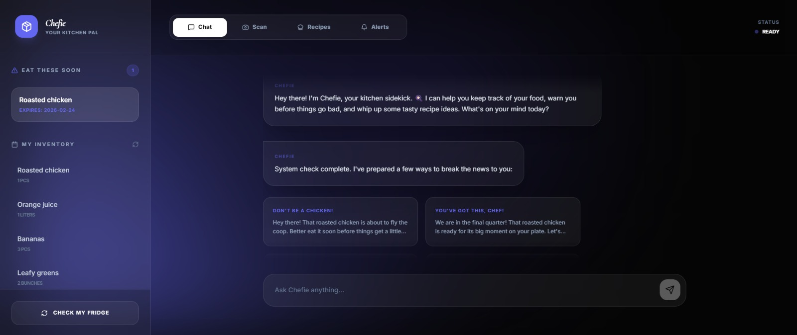
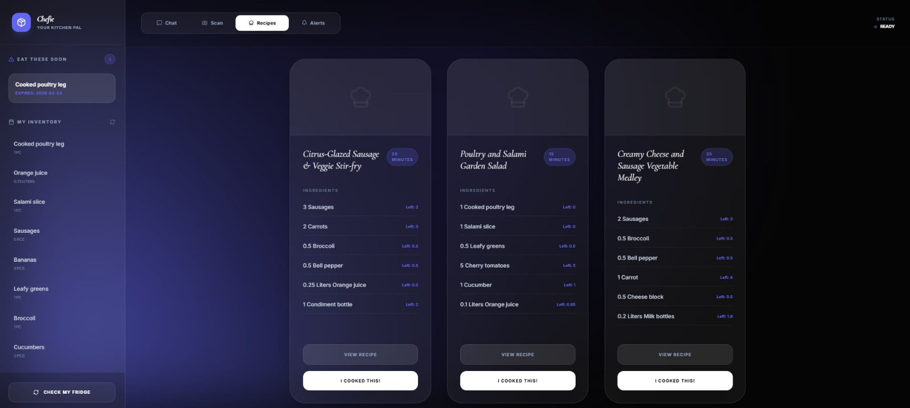
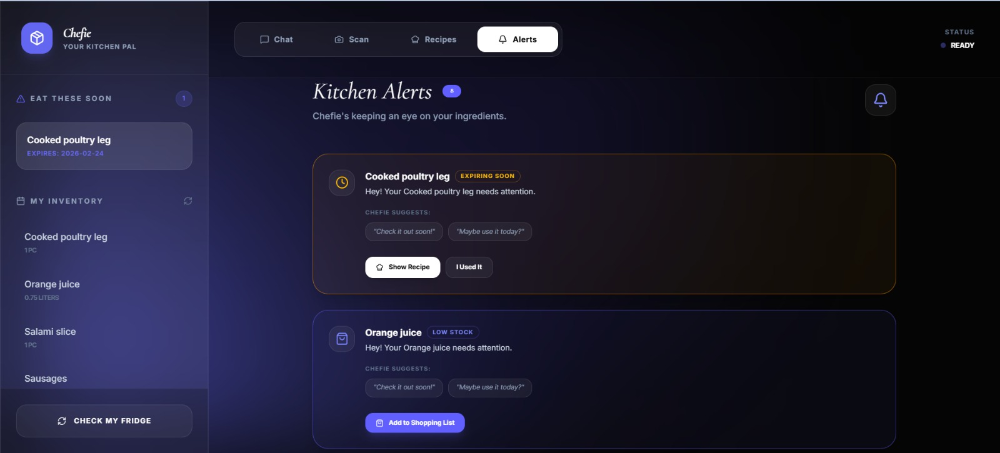
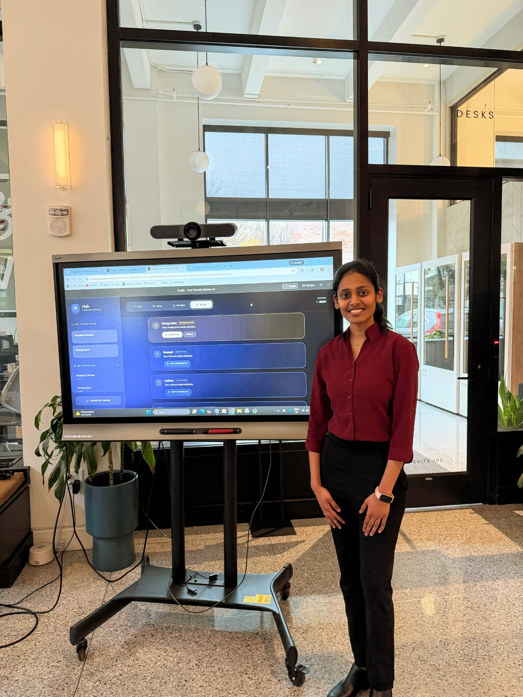

# Chefie: AI-Powered_Smart_Kitchen_Assistant


<p align="center">
  
</p>

<p align="center">
  <strong>Less Waste. Smarter Kitchens.</strong>
</p>

<p align="center">
  <strong> 2nd Place - 757 BLD WKND 2026 Hackathon</strong>
</p>

<p align="center">
  <a href="https://hackathon-757.vercel.app/">Live Demo</a>
</p>

---

## Overview

Chefie is an AI-powered kitchen assistant designed to help users manage household food inventory more efficiently and reduce food waste. The application combines computer vision, generative AI, and inventory management to automatically identify food items, track expiration dates, recommend recipes based on available ingredients, and provide contextual assistance through a conversational interface.

The project demonstrates the integration of modern web technologies with multimodal AI to build a practical consumer application.

---

## Features

### AI Inventory Scanning

Upload a refrigerator or pantry image to automatically identify food items using Google Gemini Vision. Detected items are added to the inventory along with estimated quantities and expiration information.



---

### Conversational Kitchen Assistant

Interact with the inventory using natural language. Users can ask about available ingredients, expiration dates, recipe suggestions, or update inventory through conversation.



---

### Recipe Recommendation Engine

Generate recipes based on ingredients already available in the kitchen. The system prioritizes ingredients approaching expiration to encourage efficient food utilization.



---

### Intelligent Alerts

Receive notifications for food nearing expiration, low inventory levels, and recommended actions such as cooking, shopping, or replenishing ingredients.



---

## Technology Stack

| Category | Technologies |
|-----------|--------------|
| Frontend | React, TypeScript, Vite, Tailwind CSS |
| Backend | Node.js, Express |
| AI | Google Gemini API, Gemini Vision |
| Database | SQLite (better-sqlite3) |

---

## System Workflow

```
                Refrigerator Image
                        │
                        ▼
              Google Gemini Vision
                        │
        Detect Ingredients & Metadata
                        │
                        ▼
              Inventory Database
                        │
        ┌───────────────┼───────────────┐
        ▼                               ▼
 Recipe Recommendation          Conversational Assistant
        │                               │
        └───────────────┬───────────────┘
                        ▼
               Alerts & Inventory Updates
```

---

## Project Structure

```
.
├── src/
│   ├── components/
│   ├── pages/
│   ├── services/
│   ├── hooks/
│   └── utils/
├── server.ts
├── package.json
└── README.md
```

---

## Installation

### Prerequisites

- Node.js
- npm
- Google Gemini API Key

### Clone the repository

```bash
git clone https://github.com/<your-username>/Chefie.git
cd Chefie
```

### Install dependencies

```bash
npm install
```

### Configure environment variables

Create a `.env` file and add:

```env
GEMINI_API_KEY=YOUR_API_KEY
```

### Start the application

```bash
npm run dev
```

---

## Example Workflow

1. Upload a refrigerator image or a grocery cart image.
2. Gemini Vision identifies available ingredients.
3. Inventory is updated automatically.
4. View items nearing expiration.
5. Generate recipes using available ingredients.
6. Update inventory after cooking through the chat assistant.

---

## Motivation

Food waste remains a significant household challenge, often resulting from poor inventory visibility and forgotten ingredients. Chefie aims to simplify kitchen management by providing a centralized platform that combines inventory tracking, AI-powered food recognition, recipe generation, and intelligent reminders to help users make better use of the food they already have.

---

## Future Enhancements

- Barcode scanning support
- Twilio based mobile notification
- OCR-based nutrition label recognition
- Voice interaction
- Shopping list synchronization
- Nutrition tracking
- Cloud-based inventory synchronization
- Mobile application
- Multi-user household support

---

## Screens

| Dashboard |
|------------|
|  |

| AI Scanner |
|------------|
|  |

| Recipe Recommendations |
|------------|
|  |

| Conversational Assistant |
|------------|
|  |

| Alerts |
|------------|
|  |

---

## Recognition

Chefie was awarded **2nd Place** at **757 BLD WKND 2026**, Hampton Roads' first startup hackathon, supported by **757 Startup Studios** and **Assembly**.

The project was recognized for applying multimodal AI to address a practical real-world problem by combining computer vision, conversational AI, inventory management, and recipe recommendation into a unified smart kitchen assistant.

<p align="center">
  
</p>

---

## Live Demo

A deployed version of the application is available here:

**https://hackathon-757.vercel.app/**

> *Note:* The demo may require a valid Google Gemini API key for AI-powered functionality.

---

## Author

**Varsha Natarajan**
Computer Vision • Generative AI • Full-Stack Development
